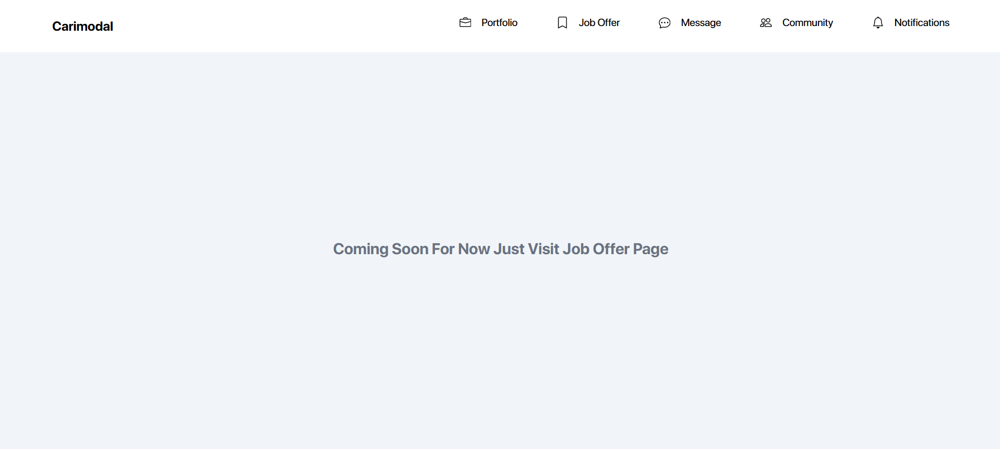
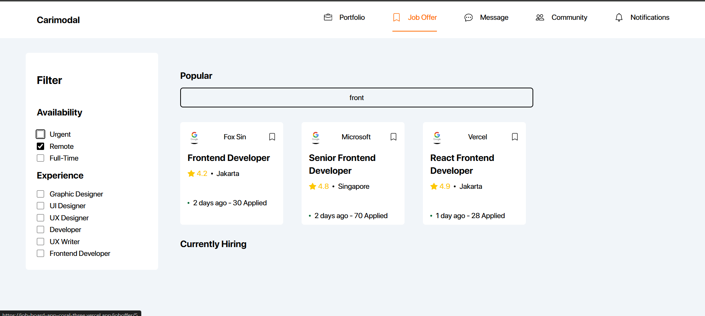
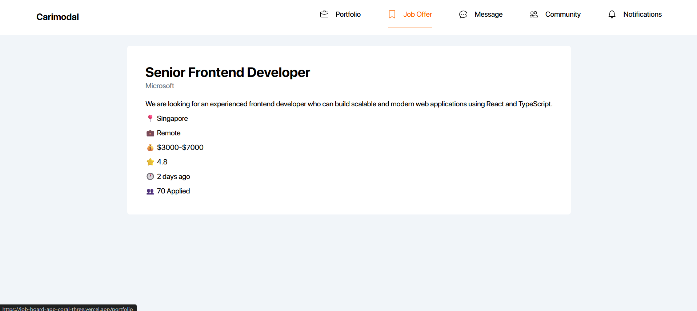

# Carimodal — Job Board App

A modern job board web application built with React, Vite, and Tailwind CSS. Browse, filter, and search for jobs by availability and experience level.

🔗 **Live Demo:** [job-board-app-coral-three.vercel.app](https://job-board-app-coral-three.vercel.app)

---

## Screenshots

### Homepage — Browse & Filter Jobs


### Search & Filter in Action


### Single Job Page


---

## Features

- 🔍 **Search** — Filter jobs by title in real time
- ✅ **Availability Filter** — Filter by Urgent, Remote, or Full-Time
- 🎯 **Experience Filter** — Filter by role (UI Designer, Developer, UX Writer, etc.)
- 🃏 **Popular Jobs** — Top 4 jobs displayed as cards
- 📋 **Currently Hiring** — Remaining jobs displayed as horizontal cards
- 📄 **Single Job Page** — Click any job to view full details
- 🧭 **React Router** — Multi-page navigation with active nav state

---

## Tech Stack

| Technology | Purpose |
|---|---|
| React 18 | UI Library |
| Vite | Build Tool |
| Tailwind CSS | Styling |
| React Router DOM | Client-side Routing |
| React Icons | Icon Library |

---

## Getting Started

### Prerequisites
- Node.js installed
- npm or yarn

### Installation

```bash
# Clone the repository
git clone https://github.com/hameedullah34/job-board-app.git

# Navigate into the project
cd job-board-app

# Install dependencies
npm install

# Start the development server
npm run dev
```

The app will run at `http://localhost:5173`

---

## Project Structure

```
src/
├── Components/
│   ├── Navbar.jsx        # Navigation bar with active state
│   ├── Layout.jsx        # Shared layout with Outlet
│   ├── Homepage.jsx      # Main page with filters and job listings
│   ├── Card.jsx          # Job card (popular section)
│   ├── HorizontalCard.jsx # Job card (currently hiring section)
│   └── JobPage.jsx       # Single job detail page
├── jobs.js               # Mock job data
└── App.jsx               # Router configuration
```

---

## How Filtering Works

- **Availability filters** use AND logic — if Remote and Urgent are both checked, only jobs that are both remote and urgent appear
- **Experience filters** use OR logic — if UX Designer and Developer are both checked, jobs matching either role appear
- **Search** filters by job title in real time using `.includes()` with case-insensitive matching
- All filters work together simultaneously

---

## Author

**Hameed Ullah** — [@hameedullah34](https://github.com/hameedullah34)

---


